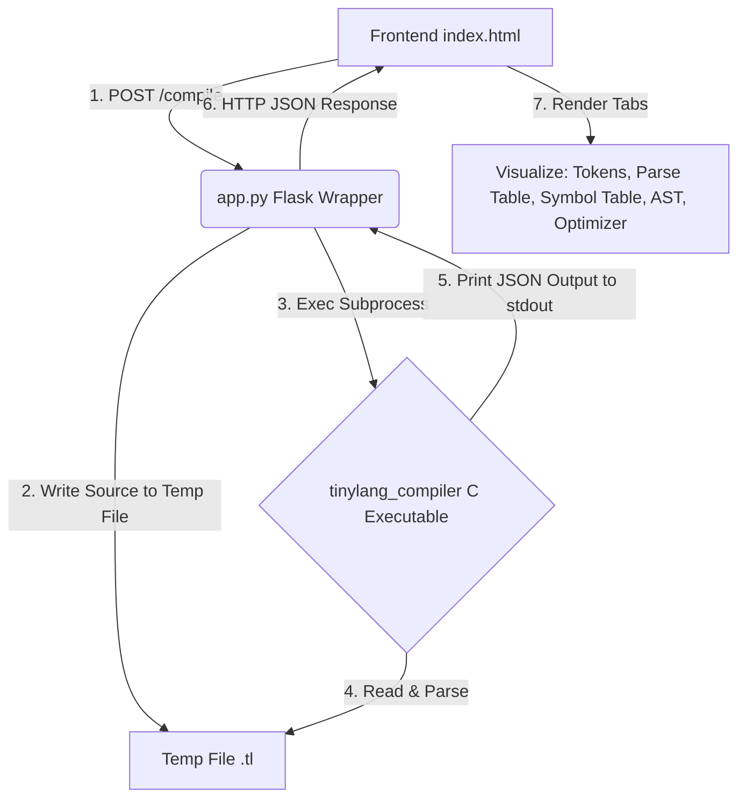

# ParserX (TinyLang) — C Compiler with Flask Frontend

ParserX is a powerful visualization tool for "TinyLang", showcasing a full compiler pipeline built in C and exposed through an interactive web frontend. 

The compiler logic (Lexer, Parser, AST Builder, Symbol Table, and Optimizer) is meticulously implemented from scratch as a standalone **C executable** (`tinylang_compiler`). A lightweight **Flask web application** in Python is used purely as a subprocess wrapper to pass code to the executable and serve its output to a beautifully designed frontend.

---

## 🗂️ Project Directory Structure

Every folder and file in this repository has a specific purpose to facilitate the compilation process or the web visualization. Here is an elaborated breakdown:

### 📁 Root Directory
* **`app.py`**: The main Flask application backend. This file serves the `index.html` frontend, receives POST requests with source code, writes it to a temporary file, invokes the C compiler executable as a subprocess, and relays the JSON output back to the client. It also acts as the backend for the "Grammar Lab" feature using `compiler/grammar_tool.py`.
* **`build_compiler.py`**: A cross-platform Python helper script designed to detect your system environment and compile the C codebase using GCC or Clang. It provides a robust alternative to `make`.
* **`build.bat`**: A simple Windows batch script that invokes GCC to compile the C files into `tinylang_compiler.exe`. Useful for Windows environments where `make` is not readily available.
* **`Makefile`**: Standard build configuration file for Linux and macOS environments. Running `make` uses GCC to compile all `.c` files in the `compiler/` directory into the `tinylang_compiler` binary.
* **`requirements.txt`**: A text file listing the Python dependencies required to run the Flask application (primarily `flask`).
* **`tinylang_compiler`** (or `.exe`): The built C compiler binary executable that performs the actual compilation stages.
* **`vercel.json`**: Configuration file for deploying the Flask application on Vercel.
* **`README.md`**: This documentation file, explaining the architecture, setup, and file structure of the project.

### 📁 `compiler/` Directory (Core C Compiler Logic)
This directory contains the entire source code for the TinyLang compiler, written in C.
* **`main.c`**: The orchestrator of the C compiler. It reads the source code file, and sequentially invokes the Lexer, Parser, Symbol Table generator, AST builder, and Optimizer. Finally, it uses `json_output.c` to serialize the internal states and prints a comprehensive JSON string to `stdout`.
* **`lexer.h` & `lexer.c`**: The Tokenizer component. It scans the raw input source code character by character and converts it into a stream of meaningful tokens (e.g., Identifiers, Numbers, Operators, Keywords).
* **`parser.h` & `parser.c`**: The syntax analyzer. It takes the token stream from the lexer and verifies if it adheres to the grammatical rules of TinyLang using a stack-based predictive LL(1) parsing approach.
* **`ast.h` & `ast.c`**: Abstract Syntax Tree builder. Constructs a tree representation of the syntactic structure of the source code. It builds nodes for expressions, statements, and functions, representing the hierarchical relationships in the code.
* **`symbol_table.h` & `symbol_table.c`**: Semantic analyzer component. It tracks variable declarations, function definitions, data types, and scope. It ensures variables are declared before use and prevents duplicate declarations.
* **`optimizer.h` & `optimizer.c`**: The code optimization engine. It traverses the AST and applies optimization techniques such as:
  - *Constant Folding*: Pre-calculating expressions involving only constants (e.g., `3 + 4` becomes `7`).
  - *Dead Code Elimination*: Removing unreachable code (e.g., code after a `return` statement).
  - *Loop Invariant Code Motion*: (If applicable) Moving expressions out of loops if they do not change across iterations.
* **`parse_table.h` & `parse_table.c`**: Generates FIRST and FOLLOW sets for the grammar rules, and constructs the LL(1) parsing table dynamically used by the parser.
* **`json_output.h` & `json_output.c`**: Helper functions to format the compiler's internal structures (Tokens, AST, Symbol Table) into valid JSON strings. This is crucial for passing the state securely from C back to the Python Flask wrapper.
* **`grammar_tool.py`**: A specialized Python script that provides functionality for the frontend "Grammar Lab". It parses arbitrary context-free grammars provided by the user, computes FIRST and FOLLOW sets, and generates parse tables, detecting any LL(1) conflicts.

### 📁 `templates/` Directory (Frontend)
* **`index.html`**: The single-page frontend application. It contains HTML structure, advanced CSS styling for a modern "IDE-like" experience, and complex JavaScript to syntax-highlight the code, send HTTP requests to the Flask backend, and beautifully render the resulting Tokens, AST (using SVG and interactive nodes), Symbol Table, Parse Table, and Optimized Code comparisons.

---

## 🏗 Architecture Workflow



## 🚀 Setup & Build Instructions

> [!IMPORTANT]
> **A C Compiler (GCC or Clang) is explicitly required to build the core engine.**
> - **Windows**: Install MINGW64 (MSYS2) and ensure `gcc` is in your PATH.
> - **Mac**: Open terminal and run `xcode-select --install` to install build tools.
> - **Linux**: Run `sudo apt install build-essential`.

### 1. Build the C Compiler Executable

Before starting the web server, you must compile the C backend:

**Using Python Build Script (Recommended - Cross Platform):**
```bash
python build_compiler.py
```

**Using `make` (Mac / Linux):**
```bash
make
```

**Using `build.bat` (Windows):**
```cmd
build.bat
```

### 2. Start the Flask Web Application

Ensure you have Python 3 installed. Install Flask if you haven't already (`pip install -r requirements.txt`), then start the app:

```bash
python app.py
```

The application will start on `http://127.0.0.1:5000`. Open this URL in your web browser. Type code into the editor on the left and click **Run** to visualize the compilation process.

## 🧪 Terminal Smoke Test

You can manually test the C executable directly via terminal to see the raw JSON output:

**Windows**:
```cmd
echo int x = 3 + 4; > test.tl
tinylang_compiler.exe test.tl
```

**Mac/Linux**:
```bash
echo "int x = 3 + 4;" > test.tl
./tinylang_compiler test.tl
```

## ✨ Frontend Features

The application supports multiple interactive visualizations accessible via tabs on the frontend:
- **Tokens**: Tokenizer outputs (`type`, `value`, `line_number`).
- **Parse Table**: The dynamically generated LL(1) parse table mappings for the built-in grammar.
- **Symbol Table**: Tracks variable names, types, block scope, and memory references.
- **AST (Abstract Syntax Tree)**: Recursive-descent built AST visualized dynamically on an interactive SVG canvas.
- **Optimizer**: A side-by-side view showing the original code, the optimized code, and line-by-line explanations of applied optimizations (Constant Folding, Dead Code Elimination).
- **Grammar Lab**: A dedicated playground (`/grammar-analyze`) to define custom grammars and visualize their FIRST/FOLLOW sets and detect LL(1) conflicts.
