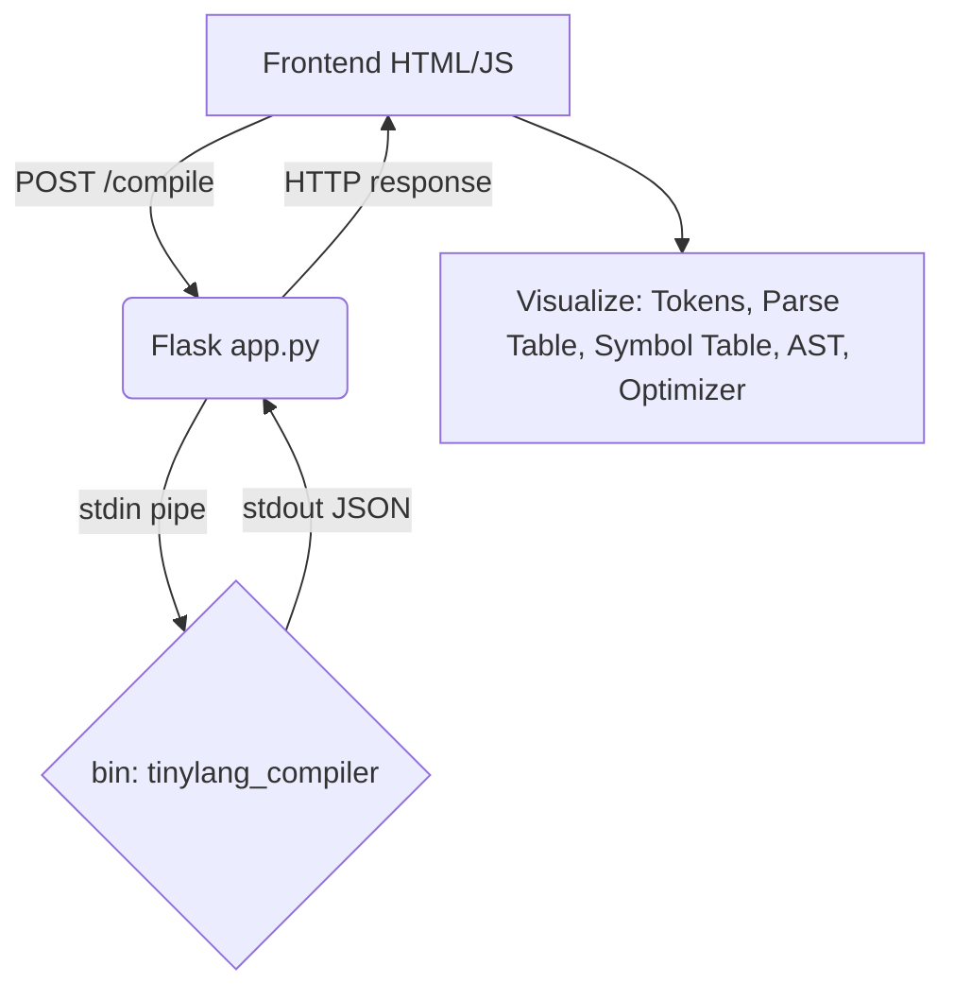

# ParserX (TinyLang) — C Compiler with Flask Frontend

ParserX is a visualization tool for "TinyLang", showcasing a full compiler pipeline built in C and exposed through a web frontend.

The compiler logic (Lexer, Parser, AST Builder, Symbol Table, and Optimizer) is implemented as a standalone **C executable** (`tinylang_compiler`). A lightweight **Flask web application** is used purely as a subprocess wrapper to pass code to the executable and serve its output to a beautifully designed frontend.

## 🗂️ Project Structure

```
.
├── compiler/
│   ├── main.c              # Orchestrates pipeline, prints JSON to stdout
│   ├── lexer.c / .h        # Tokenizer
│   ├── parse_table.c / .h  # FIRST/FOLLOW + LL(1) table construction
│   ├── parser.c / .h       # Stack-based predictive parser
│   ├── ast.c / .h          # Recursive-descent AST builder & serializer
│   ├── symbol_table.c / .h # Declaration and reference tracking
│   ├── optimizer.c / .h    # Constant folding, dead code elimination, loop invariants
│   ├── json_output.c / .h  # JSON string builder helpers
│   └── grammar_tool.py     # Python script for arbitrary grammar analysis
├── templates/              # HTML frontend files
├── app.py                  # Flask subprocess wrapper (no compiler logic)
├── Makefile                # Build configuration
├── build.bat               # Windows build script
└── build_compiler.py       # Python build helper (auto-detects gcc)
```

## 🏗 Architecture



## 🚀 Setup & Build Instructions

> [!IMPORTANT]
> **A C Compiler (GCC) is required to build the core engine.**
> - **Windows**: Use MINGW64 (MSYS2)
> - **Mac**: Require Xcode Command Line Tools (`xcode-select --install`)

### 1. Build the C Compiler

**Using `make` (Mac / Linux):**
```bash
make
```
This generates the `tinylang_compiler` executable.

**Using `make` or `build.bat` (Windows):**
```bash
make
# OR 
build.bat
```
This generates the `tinylang_compiler.exe` executable.

**Alternative (Python Build Script):**
```bash
python build_compiler.py
```

### 2. Start the Application

You need Python 3 installed. Start the Flask application by running:
```bash
python app.py
```
By default, the application runs on `http://127.0.0.1:3000`. 
Open the URL in your browser and click **Run** on any example to visualize the compiler pipeline.

## 🧪 Smoke Test

You can manually test the C executable directly via terminal:

**Windows**:
```cmd
echo int x = 3 + 4; | tinylang_compiler.exe
```

**Mac/Linux**:
```bash
echo "int x = 3 + 4;" | ./tinylang_compiler
```

This will output the internal compiler states in JSON format.

## ✨ Features

The application supports multiple interactive visualizations accessible via tabs on the frontend:
- **Tokens**: Tokenizer outputs (`type`, `value`, `line`).
- **Parse Table**: Generated LL(1) parse table mappings.
- **Symbol Table**: Tracks variable names, types, scope, and references.
- **AST**: Recursive-descent built Abstract Syntax Tree.
- **Optimizer**: Shows original code, optimized code, and applied optimization strategies.

> [!NOTE]
> The **Grammar Lab** feature (`/grammar-analyze`) remains supported in Python to allow analysis of arbitrary user-provided grammars rather than being strictly limited to the TinyLang rules.
